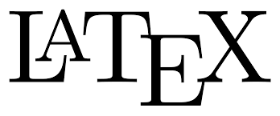

## 👋 Hi there! I'm Omid Emamjomehzadeh 

🎓 I’m a **Ph.D. candidate** at **New York University (NYU)** . 

💧 My Ph.D. project focuses on **flood risk analysis**, **large-scale hydrologic modeling**, and **statistical techniques**.

🧰 I have worked on **urban** and **agricultural water management**, leveraging **agent-based modeling with reinforcement learning (RL)**, **machine learning (ML) surrogate modeling**, and **uncertainty analysis** to **develop robust and resilient decision support systems** that help stakeholders make more informed decisions.

---

### 🔬 Research & Interests

- 🌊 Urban & agricultural water management
- 🏙️ **Risk analysis** of **stormwater systems**
- 🌧️ **resilient and robust water systems**
- 📊 **Statistical & data-driven** approaches to hydrology

---
### 🚀  Languages and Tools

  
  
  
  
  
  

---

### 🤝 Let’s connect

- 📫 Reach me at: [omid.emamjomehzadeh@nyu.edu]  

---

#### 😄 Pronouns: He/Him 

<!--
**omidemam/omidemam** is a ✨ _special_ ✨ repository because its `README.md` (this file) appears on your GitHub profile.
