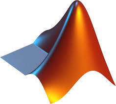

## 👩🏻‍💻 About me
I am a PhD candidate at NYU. My primary research interests are in the fields of flood risk analysis, large-scale hydrologic modeling, and statistical techniques.

## 🚀  Languages and Tools

  
  
  
  
  
  

<!--
**omidemam/omidemam** is a ✨ _special_ ✨ repository because its `README.md` (this file) appears on your GitHub profile.

Here are some ideas to get you started:

- 🔭 I’m currently working on ...
- 🌱 I’m currently learning ...
- 👯 I’m looking to collaborate on ...
- 🤔 I’m looking for help with ...
- 💬 Ask me about ...
- 📫 How to reach me: ...
- 😄 Pronouns: ...
- ⚡ Fun fact: ...
-->
